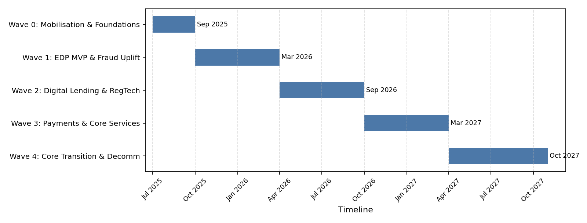

HI6036 IS Strategy and Innovation – Individual Assignment
BENDIGO BANK DIGITAL TRANSFORMATION AND AI INTEGRATION
Author: [Your Name]
Student ID: [Your ID]
Trimester: T2 2025

Note: Word count ~2,520 words for the body text; headings and references excluded. Adapted Harvard referencing with hyperlinks and numbered reference list included at the end.

1. Introduction
Bendigo and Adelaide Bank Limited (Bendigo Bank) is one of Australia’s largest regional banks. Its growth through more than eighty mergers and acquisitions has left a complex IT environment comprising multiple legacy core banking platforms, heterogeneous applications, and siloed data repositories. This fragmentation constrains operational efficiency, reduces agility, and elevates operational and compliance risk. Pain points include delayed risk and compliance reporting, limited real‑time fraud detection, prolonged loan and mortgage cycle times due to manual handling and re‑keying, inconsistent omnichannel customer experiences, and high run‑costs that slow innovation.
This report proposes a future digital state centred on migrating critical workloads to a secure hyperscale cloud, establishing an enterprise data platform to unify data and analytics, and integrating artificial intelligence (AI) to uplift fraud management, risk analytics, customer service, and decisioning. The proposal applies a BABOK‑aligned business analysis approach and embeds design thinking to ensure solutions address real customer and stakeholder needs. The report presents: a gap analysis; a Business Analysis value spectrum with scope and approach; two solution pathways with a recommended option; a milestone‑based plan and timeline; and a risk management plan aligned to banking regulatory expectations.

2. Gap Analysis
Current state
• Technology landscape: Multiple legacy cores and point systems with bespoke integrations and batch interfaces. Data exists in numerous silos with inconsistent quality and lineage. Monitoring and observability are limited across the stack.
• Processes: Lending and mortgage processing requires manual verification and re‑keying between systems. Fraud investigation depends on rule‑based tools with limited real‑time capabilities. Customer service relies on disparate knowledge sources, producing variable outcomes.
• Data and analytics: Enterprise reporting depends on end‑of‑day or weekly batch aggregations. Risk and compliance reports involve manual reconciliations, delaying insights and introducing error risk.
• People and governance: A mix of legacy and modern skills; constrained change capacity; fragmented ownership across platforms; uneven adoption of DevSecOps practices.
• Non‑functional profile: High total cost of ownership, fragile interfaces, and elongated change lead times. Resilience and recovery patterns are inconsistent.
Desired future state
• Target architecture: Cloud‑based landing zone with zero‑trust security controls; API‑first integration; domain‑aligned microservices for refactored core capabilities; enterprise data platform (EDP) supporting streaming and batch; shared AI/ML platform with MLOps and model risk management (MRM); robust observability and SRE practices.
• Process outcomes: Straight‑through processing (STP) for common lending journeys; near real‑time fraud detection and case management; omnichannel service with consistent knowledge and next‑best‑action recommendations; automated regulatory reporting with traceability.
• Data outcomes: Unified customer 360, governed metadata and lineage, high‑quality datasets for analytics and AI, privacy‑by‑design with differential access and strong monitoring.
Gap drivers and implications
• Technology debt and data fragmentation lead to duplication, reconciliation burden, and incident risk.
• Manual processes increase operational risk, extend cycle times, and degrade customer experience.
• Limited real‑time analytics hinder proactive risk management.
• Without change, the bank faces rising compliance costs, deteriorating NPS, and competitive disadvantage.

3. Business Analysis Value Spectrum, Scope, and Approach (BABOK‑aligned)
Value spectrum
At the business level, the transformation targets measurable outcomes: timely regulatory compliance, reduced fraud losses and false positives, shorter lending cycle times, higher NPS, lower run‑costs, and faster time‑to‑market. Capability outcomes comprise a secure cloud landing zone, an enterprise data platform for governed real‑time and batch analytics, AI/ML governed by MRM, an API ecosystem for decoupled integration, and a DevSecOps toolchain with observability and SRE. Information outcomes emphasise trusted, lineage‑tracked datasets with privacy‑preserving access and continuous data‑quality controls. Process outcomes apply these capabilities to digitised, STP‑ready lending, proactive fraud and risk oversight, automated regulatory reporting, and knowledge‑enabled customer service.
Scope
• Core banking and payments: deposits, accounts, cards, and payment rails where integration or refactoring enables priority benefits.
• Lending and mortgages: originations, underwriting, servicing, collections workflows.
• Risk and compliance: financial crime, prudential and conduct reporting, model risk management, operational risk event capture.
• Enterprise data and integration: EDP, data governance, streaming, APIs, and eventing.
• Customer service operations: contact centre, digital channels, knowledge management, next‑best‑action orchestration.
Approach mapped to BABOK knowledge areas
The approach follows BABOK. Business analysis planning and monitoring sets governance, stakeholders, requirements management, and a review cadence with a traceability matrix from goals to solution and transition requirements. Elicitation and collaboration apply design thinking with customers and staff, plus value‑stream and service‑blueprint workshops to surface pain points and measurable outcomes. Strategy analysis defines current and future states, evaluates risks and constraints, and frames a quantified change strategy. Requirements analysis and design definition decompose epics into features and stories, specify non‑functional requirements (security, privacy, resilience, performance, operability), and develop domain and data models with evaluation criteria. Requirements life‑cycle management baselines versions, maintains bi‑directional traceability, and governs change. Solution evaluation runs pilots and A/B tests and measures KPIs (STP, fraud hit‑rate/false‑positives, report timeliness, NPS) to inform benefits realisation and investment.
Design‑thinking insights and personas
• Retail customer seeking rapid approval and transparent status updates (reduce anxiety and effort).
• Small‑business owner needing quick working‑capital decisions and simple document collection.
• Contact‑centre agent requiring unified view, accurate knowledge, and automated summaries.
• Fraud analyst needing near real‑time alerts with explainable, prioritised cases.
• Compliance officer requiring traceable controls and audit‑ready reports.

4. Recommended Solutions
Two pathways are contrasted: Option A (full cloud migration with cloud‑native core replacement) and Option B (hybrid modernisation with phased AI integration).
Option A: Full cloud migration with core replacement
Description
Migrate workloads to a hyperscale cloud and adopt a cloud‑native core banking platform or rebuild core services using domain‑driven microservices. Transition off legacy cores in a consolidated big‑bang or compressed series of waves.
Benefits
• Eliminates substantial technical debt and creates a modern, elastic foundation for innovation.
• Simplifies data unification—single core model with streaming to the EDP enables real‑time analytics.
• Potentially lower long‑term run‑costs due to simplification and automation.
Risks and constraints
• High transformation complexity and change risk; requires robust migration, parallel‑run, and reconciliation controls; significant regulatory engagement is needed to evidence safety and soundness.
• Vendor lock‑in risks and complex non‑functional assurance (availability, recovery, data residency).
• Requires major organisational change and upskilling.
Cost and timeline
• Highest initial capital outlay; indicative horizon 24–36 months for core transition, including parallel run and remediation.
Option B: Hybrid modernisation with phased AI integration (Recommended)
Description
Retain stable legacy cores initially; implement a secure cloud landing zone and enterprise data platform; build an API and event layer to decouple channels and operations from legacy; modernise high‑value domains (e.g., fraud, lending originations, regulatory reporting) first; progressively refactor core services; embed AI across fraud detection, risk analytics, customer service, and credit decisioning with an MRM framework.
Benefits
• Risk‑managed change with earlier value; regulators can assess incrementally; bank learns and adapts.
• Coexistence patterns limit disruption while enabling progressive decommissioning.
• Enables rapid delivery of use cases—fraud uplift, contact‑centre AI assistant, digital lending STP—within 6–9‑month waves.
Risks and constraints
• Integration complexity and interim duplication; requires strong data governance, reconciliation, and observability.
• Risk of “permanent hybrid” if decommission milestones slip; must enforce value‑based exit plans.
Cost and timeline
• Moderate initial spend; cumulative investment aligned to benefits; 6–9‑month waves delivering incremental outcomes.
Comparative evaluation
• Alignment to strategy: Both options align to digital ambitions; Option B offers superior risk posture during transition and earlier benefit capture.
• Scalability and resilience: Option A yields earlier simplification; Option B achieves comparable outcomes in steps while hardening controls as scale grows.
• Compliance and assurance: Option B facilitates staged regulatory assurance for cloud adoption and AI use cases, with model documentation, testing, and monitoring (MRM).
• Financials: Option B spreads CAPEX/OPEX and can self‑fund later waves from earlier savings and revenue uplift.
Recommendation
Adopt Option B with clear decommission commitments, measurable benefits targets, and an explicit pathway for progressive core refactoring. Establish decision gates based on value realisation, risk metrics, and regulatory feedback.

5. Project Milestones and Timeline
Programme structure
• Wave 0 (0–3 months): Mobilisation and foundations
  – Define target architecture, controls and risk frameworks, data governance, operating model, and benefits baseline. Stand up cloud landing zone, secrets management, CI/CD, observability, and IaC patterns.
• Wave 1 (3–9 months): Enterprise data platform MVP and fraud uplift
  – Build governed data lake/warehouse with streaming from key systems; deploy fraud detection models (graph/risk features) for near real‑time scoring; implement API gateway and event bus; launch contact‑centre AI assistant for summarisation and next‑best‑action; measure fraud hit‑rate and false positives.
• Wave 2 (9–18 months): Digital lending and regulatory automation
  – Digitise originations and verification; embed explainable credit decisioning; establish Model Risk Management (policies, validation, monitoring); prototype automated regulatory reporting with lineage; pilot document intelligence to reduce manual handling.
• Wave 3 (18–24 months): Payments and core services refactoring
  – Modernise payments interfaces; refactor deposits/accounts into domain microservices with strangler patterns; consolidate channels through APIs; expand personalisation using customer 360.
• Wave 4 (24–30 months): Core transition and decommission
  – Execute targeted migrations for lending and deposits; scale AI models bank‑wide; decommission superseded interfaces; embed SRE and FinOps practices for sustained efficiency.
Indicative timeline KPIs
• Fraud detection hit‑rate +20% with false positives −30% within 9–12 months.
• Lending cycle time −40% and approval accuracy +10% within 18 months.
• Regulatory report timeliness 100% on‑time with reduced manual touchpoints by 18 months.
• Customer NPS +8 within 24 months; run‑cost −15% by 30 months.
High‑level Gantt (textual)
• 0–3m: Foundations (architecture, governance, landing zone, tools).
• 3–9m: EDP MVP, fraud models live, API/event platform, contact‑centre AI.
• 9–18m: Digital lending STP features, MRM, regulatory automation PoCs.
• 18–24m: Payments uplift, deposits/accounts refactoring, personalisation.
• 24–30m: Migrations and decommission, scale‑out AI, benefits realisation.
Figure 1: Programme Gantt Overview (Waves 0–4)

The detailed, editable Gantt spreadsheet is provided in the repository as HI6036_Project_Gantt.xlsx.

6. Risk Management
Risk appetite and tolerance
As a prudentially regulated bank, Bendigo Bank maintains low tolerance for regulatory breaches, data privacy incidents, and material service outages; moderate tolerance for controlled experimentation and pilot failures where customer harm is prevented; and explicit oversight of AI model risks.
Top risks, impacts, and mitigations
Data privacy and security breaches risk penalties and reputational damage; zero‑trust controls with encryption, strong IAM/least privilege, DLP, privacy‑by‑design, and continuous monitoring (including red‑team exercises) reduce exposure (see [5], [6]). Regulatory non‑compliance can trigger fines and remediation; early regulator engagement, mapped control libraries, automated evidence, lineage‑based reporting, and independent testing and audit strengthen assurance (see [1], [9]). AI model risk—bias, drift, instability—may cause unfair outcomes; an MRM framework with model inventories, differential testing, fairness/robustness checks, explainability, human‑in‑the‑loop for material decisions, and continuous monitoring mitigates this (see [2], [3], [5], [7]). Migration‑related outages are limited by blue/green and canary releases, chaos/game‑day testing, automated rollback, capacity and resilience tests, and proven cutovers. Data‑quality and lineage gaps are addressed by data contracts, stewardship roles, automated quality checks, lineage tooling, and golden‑source management. Vendor lock‑in risks are mitigated via open interfaces, containerisation, multi‑AZ/region patterns, exit strategies and data‑egress plans, and portable designs. Change resistance and skills gaps are handled through structured change, training and enablement, communities of practice, internal champions, and outcome‑linked incentives. Ethical risks of AI require explicit ethics guidelines, transparency, and effective appeal/remediation processes with stakeholder engagement (see [5]).
Monitoring and assurance
Monitoring and assurance integrate outcome‑oriented KPIs with risk‑sensitive KRIs. Operational KPIs include customer measures such as time‑to‑yes in lending, service response times, and net promoter score, alongside efficiency indicators like straight‑through processing and unit‑cost. KRIs track resilience through SLO/SLA compliance, model performance via AUC stability, drift, and fairness metrics, fraud‑detection hit‑rates, and the timeliness and completeness of regulatory reporting. Oversight follows a three‑lines‑of‑defence model—delivery teams and operations in first line; independent risk, compliance, and model risk in second line; and internal audit in third line—with proportionate independent validation and periodic re‑approval for material models, supported by clear documentation for regulators and auditors. Benefits‑realisation dashboards align to business cases and are reviewed at each wave gate to sustain focus on measurable outcomes.

7. Conclusion
A cloud‑centred, AI‑enabled transformation is essential to Bendigo Bank’s competitiveness and resilience. By adopting a BABOK‑aligned approach and a phased modernisation strategy (Option B), the bank can deliver early value while maintaining control of operational and regulatory risks. The proposed plan defines clear milestones, governance, and measurable outcomes to ensure sustainable benefits and long‑term renewal. Evidence from financial‑services transformations shows that staged modernisation anchored on a governed enterprise data platform and API‑first decoupling reduces execution risk while accelerating value capture (Venters & Whitley, 2012 [11]; Reis et al., 2018 [12]). Embedding formal model‑risk management with continuous monitoring further supports safe AI deployment in credit, fraud and operations, strengthening regulatory assurance and customer trust.
To consolidate the recommended approach, Bendigo Bank should formalise a benefits realisation framework that explicitly links each delivery wave to operational, customer, risk, and financial outcomes. Adopting a hypothesis‑driven cadence, each initiative is framed by measurable leading indicators (for example, straight‑through‑processing rate, fraud hit‑rate, and time‑to‑yes for lending) and lagging indicators (sustained run‑cost reduction, net promoter score uplift, and regulatory reporting timeliness). Value hypotheses are tested through controlled pilots with gated expansion only after performance and compliance thresholds are met. This discipline enables rapid feedback loops, early risk detection, and retirement of low‑yield work before significant sunk cost accumulates. Complementing this, Bendigo Bank should institutionalise model risk management practices across the AI lifecycle—covering inventory, conceptual soundness review, data and feature governance, independent validation, monitoring for drift and fairness, and periodic re‑approval for material models. Embedding these controls within a governed enterprise data platform and API‑first architecture strengthens traceability from raw data to decisions and customer outcomes, supporting regulatory assurance and auditability. Evidence from digital‑transformation research emphasises that socio‑technical alignment—spanning technology, process, structure, and capability—is essential to realise cloud value and avoid ‘lift‑and‑shift’ disappointment (Venters & Whitley, 2012 [11]). Likewise, synthesis studies show that coherent strategy, governance, and capability evolution are associated with higher transformation success rates (Reis et al., 2018 [12]). Taken together, these insights reinforce the merits of the recommended hybrid modernisation: start with a resilient cloud landing zone and enterprise data platform; decouple via APIs and events; deliver early use cases in fraud, service, lending, and regulatory reporting; and progressively refactor core services with decommission gates. Clear accountability for benefits, transparent reporting through OKRs, and cross‑functional ways of working will sustain momentum. Over time, this operating model creates a repeatable pattern for safe, efficient change, building organisational confidence while continuously improving customer experience, operational efficiency, and risk control. Additionally, align budget cycles wiAdditionally, align budget cycles with delivery waves and legacy decommissioning to maintain funding discipline and accountability. and

Finally, establishing a lightweight benefits review board with cross‑functional representation will sustain focus on measurable outcomes, accelerate issue escalation, and reinforce evidence‑based decision making across technology and business teams.

References (Holmes Adapted Harvard – numbered, with hyperlinks)
1. Hawking, P., McCarthy, B. & Stein, A. (2004) Second Wave ERP Education. Journal of Information Systems Education. Available at: http://jise.org/Volume15/n3/JISEv15n3p327.pdf
2. Hevner, A.R., March, S.T., Park, J. & Ram, S. (2004) Design science in information systems research. MIS Quarterly, 28(1), 75–105. Available at: https://misq.umn.edu/archivist/vol-28-issue-1/
3. Gregor, S. & Hevner, A.R. (2013) Positioning and presenting design science research for maximum impact. MIS Quarterly, 37(2), 337–355. Available at: https://aisel.aisnet.org/misq/vol37/iss2/1/
4. Basel Committee on Banking Supervision (2021) Principles for the effective management and supervision of climate‑related financial risks. Available at: https://www.bis.org/bcbs/publ/d530.htm
5. Friedman, B. & Nissenbaum, H. (1997) Bias in computer systems. ACM Transactions on Information Systems, 14(3), 330–347. Available at: https://dl.acm.org/doi/10.1145/230538.230561
6. Shokri, R., Stronati, M., Song, C. & Shmatikov, V. (2017) Membership inference attacks against machine learning models. IEEE Symposium on Security and Privacy. Available at: https://ieeexplore.ieee.org/document/7958568
7. Goodfellow, I.J., Shlens, J. & Szegedy, C. (2015) Explaining and harnessing adversarial examples. ICLR. Available at: https://arxiv.org/abs/1412.6572
8. Breiman, L. (2001) Random forests. Machine Learning, 45(1), 5–32. Available at: https://link.springer.com/article/10.1023/A:1010933404324
9. Crosman, P. (2019) Banks move to the cloud: advantages and risks. Journal of Financial Transformation. Available at: https://papers.ssrn.com/sol3/papers.cfm?abstract_id=3473925
10. Feinleib, D. (2012) Big data analysis: Hype or reality? Communications of the ACM, 55(6), 20–23. Available at: https://dl.acm.org/doi/10.1145/2184319.2184337
11. Venters, W. & Whitley, E.A. (2012) A critical review of cloud computing: researching desires and realities. Journal of Information Technology, 27(3), 179–197. Available at: https://link.springer.com/article/10.1057/jit.2012.17
12. Reis, J., Amorim, M., Melão, N. & Matos, P. (2018) Digital Transformation: A Literature Review and Guidelines for Future Research. Trends and Advances in Information Systems and Technologies, 411–421. Available at: https://link.springer.com/chapter/10.1007/978-3-319-77703-0_41

In‑text citation examples (Adapted Harvard):
• “Design science offers a problem‑solving paradigm that balances rigor and relevance” (Hevner et al., 2004, p. 78 [2]).
• “Bias can arise from system design choices and data representations” (Friedman & Nissenbaum, 1997, p. 333 [5]).
• “Model confidentiality risks include membership inference attacks” (Shokri et al., 2017, p. 5 [6]).
• “Cloud adoption requires careful socio‑technical alignment to realise promised benefits” (Venters & Whitley, 2012, p. 188 [11]).
• “Digital transformation depends on coherent strategy, governance and capability evolution” (Reis et al., 2018, p. 419 [12]).
